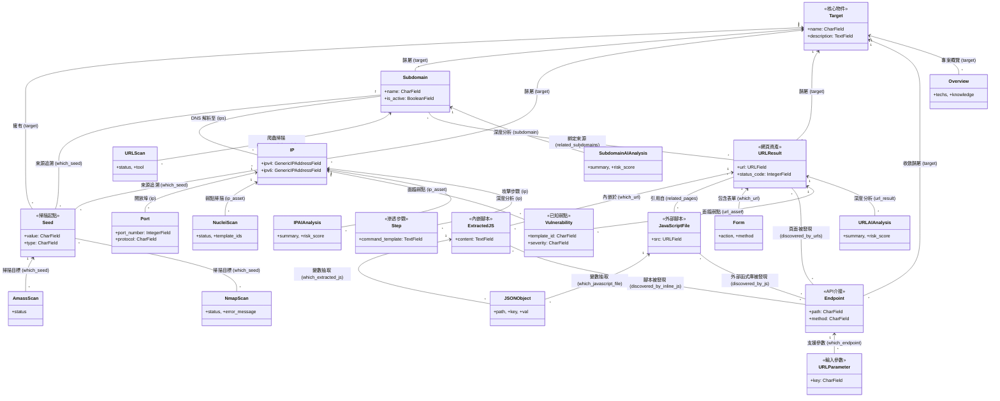

# Core App 模型架構設計與報告 (apps/core/models)

本文件深入解析了 `apps/core/models` 目錄下的所有 Django 模型分層與關聯，並闡述系統的底層架構設計理念（Architecture Design Philosophy）。

---

## 架構設計理念 (Architecture Design Philosophy)

我們的系統架構以「資料生命週期」與「多元維度可追溯性」為核心，主要遵循以下幾項設計典範：

1. **階層化與樹狀延伸的資產收斂 (Hierarchical Asset Convergence)**
   所有資產皆圍繞著最頂層的 `Target`。從初始的 `Seed`（如網域、IP 段）發散至 `Subdomain`、`IP`，再向下探索至更細緻的 `Port`、`URLResult`，最終收斂為唯一的 `Endpoint`（API 介面）。無論資產經過多少層次的爬蟲與掃描擴展，最終都可以透過關聯（或 Django Signals 的自動同步）安全地歸屬於起點的 `Target`，確保在多專案並行時不會發生資產混淆，且刪除時得以乾淨地連鎖移除（Cascade Deletion）。

2. **精確的血緣追溯與多對多來源映射 (Lineage Traceability & Multi-Source Mapping)**
   資產模型的設計不僅僅記錄「它是什麼」，更著重記錄「它是怎麼來的」。大量使用 `ManyToManyField`（如 `which_seed`, `discovered_by_scans`, `discovered_by_urls`, `discovered_by_js`），使得我們能夠輕易追溯一個 `Endpoint` 是從哪個 JavaScript 檔案內嵌的呼叫中被發現，而該 JS 檔案又是從哪個 `URLResult` 被爬取，最終追溯回最初的 `Seed`。這賦予了我們繪製完整資產發現路徑（Discovery Path）的能力。

3. **掃描引擎與資產的關注點分離 (Decoupling of Scanning Engines and Assets)**
   資產狀態（如 `Subdomain`, `IP`）與掃描任務紀錄（如 `NmapScan`, `SubfinderScan`, `NucleiScan`）被乾淨地劃分開來。掃描紀錄作為「異步任務的憑證（Ticket）」，專注於記錄執行狀態、參數與產出規模；而掃描的實質結果則會以 Upsert（更新或新增）的方式合併進資產主表中。這樣確保了資產清單永遠是最新、最乾淨的「唯一事實來源（Single Source of Truth）」，而不會因為多次重複掃描而產生冗餘紀錄。此外，資產主表普遍套用了 `simple_history` 以保留所有時序變更。

4. **粗粒度靜態與細粒度動態分析 (Granular Web Analysis)**
   將網頁探測拆解為極致細微的實體。從宏觀的 `URLResult` 剝離出 `Form`, `Link`, `ExtractedJS`, `JSONObject` 等微觀結構。這使得我們後續進行風險評分、參數爆破與 JavaScript 靜態分析時，不需要反覆重新請求網路，而是直接對關聯式資料庫進行查詢操作。在同一個 `Target` 範圍下，`Endpoint` 加上 `HTTP Method` 成為唯一的識別單元，並將推斷出的 `URLParameter` 掛載其下，構築了動態應用程式安全測試 (DAST) 的完美基石。

5. **AI 分析與人工智慧/專家協作 (AI & Human Collaboration Synergy)**
   在 `analyze/` 目錄中，我們明確區分了「程式自動化事實」與「分析見解」。`IPAIAnalysis`, `SubdomainAIAnalysis`, `URLAIAnalysis` 這類模型專門用來儲存大模型的推理結果（包含風險評分、總結與漏洞推斷）。這層設計能夠在不污染基礎網路事實的情況下，支援進階的情境堆疊與滲透攻擊步驟（`Step`, `Payload`, `Method`, `Verification`）規劃。

---

## 實體關聯圖 (ERD) 與詳細關聯說明

以下類別圖中的箭頭已標註了具體的關聯含義（例如「屬於 (belongs to)」、「透過...發現 (discovered by)」），以幫助理解資料流向：

## 總結

`apps/core/models` 的設計不僅在於儲存爬蟲掃描的原始數據，而是提供了一個多維度、強連結的資訊網路。當我們面對龐大的子域名、IP 或是上萬條 URL 時，這套架構允許我們的 AI 助手或資安專家能透過單一 `Endpoint` 反向揪出隱藏在複雜前端打包腳本 (`JavaScriptFile`) 中的脆弱 API，進一步規劃並執行自動化攻擊工作流（`Step`），完美體現了現代化滲透測試自動化的最佳實踐。
