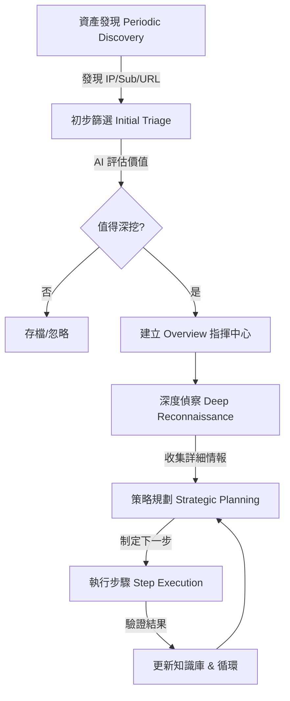

# C2 Django AI 內部工作流 (Internal Workflow)

本文件描述了 C2 Django AI 平台的自動化工作流程，從資產發現到策略規劃與執行。

## 核心流程槪覽

## 詳細階段說明

### 1. 資產發現 (Asset Discovery)
- **觸發源**: 週期性 Celery 任務 `periodic_initial_analysis_bootstrapper`。
- **動作**: 檢索資料庫中尚未處理的新資產 (IP, Subdomain, URLResult)。
- **工具**: Nmap, Subfinder, Get_all_url。

### 2. 初步篩選 (Initial Triage)
- **記錄**: 建立 `InitialAIAnalysis` 記錄。
- **AI 角色**: `Triage Agent` 判斷資產用途與風險等級。
- **結果**: 標記 `worth_deep_analysis` 為 True 的資產將被升級。

### 3. 指揮中心與深度偵察 (Overview & Deep Recon)
- **核心**: 建立 `Overview` 作為單次攻擊任務的上下文中心。
- **深度分析**: 針對不同資產型別執行 `IPAIAnalysis`/`SubdomainAIAnalysis` 等，提取技術棧與潛在漏洞。

### 4. 策略規劃 (Strategic Planning)
- **引擎**: `propose_next_steps` 任務。
- **AI 角色**: `Strategy Agent` 分析全域 Context，包括歷史失敗步驟與新發現的技術。
- **輸出**: 產出 JSON 格式的指令動作 (`command_actions`)。

### 5. 執行與迴圈 (Execution & Feedback Loop)
- **執行**: `Step` 記錄被派發至 Celery 執行 (如 Nuclei 掃描)。
- **學習**: 執行結果回傳至 AI 進行驗證，更新 `Overview.knowledge`，並由 AI 決定是否需要調整後續計畫。
